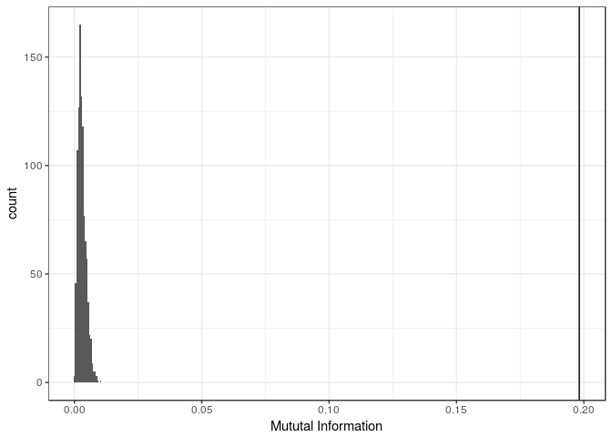
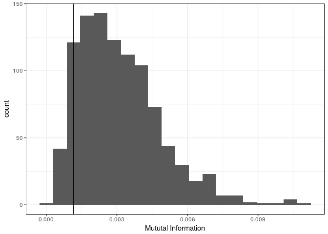

MI perm test demo
================
Frank
April 21, 2018

Simulate some data
------------------

``` r
library(tidyverse)
```

    ## Loading tidyverse: ggplot2
    ## Loading tidyverse: tibble
    ## Loading tidyverse: tidyr
    ## Loading tidyverse: readr
    ## Loading tidyverse: purrr
    ## Loading tidyverse: dplyr

    ## Conflicts with tidy packages ----------------------------------------------

    ## filter(): dplyr, stats
    ## lag():    dplyr, stats

``` r
N = 1000
diagnoses = c(rmultinom(1, N, prob=c(0.25, 0.125, 0.125, 0.5)))

interventions = rbind(data.frame(diagnoses='A', Intervention=c('a','b','c'), N=c(rmultinom(1, diagnoses[1], prob=c(.80, 0.15, 0.05)))),
                      data.frame(diagnoses='B', Intervention=c('a','b','c'), N=c(rmultinom(1, diagnoses[2], prob=c(.30, 0.60, 0.10)))),
                      data.frame(diagnoses='C', Intervention=c('a','b','c'), N=c(rmultinom(1, diagnoses[3], prob=c(.30, 0.30, 0.40)))),
                      data.frame(diagnoses='D', Intervention=c('a','b','c'), N=c(rmultinom(1, diagnoses[4], prob=c(.20, 0.20, 0.60)))))

re = function(Z){ Z[rep(1, Z$N),] %>% select(-N) } 

d = interventions %>%
  mutate(used=1) %>%
  spread(Intervention, used, fill=0) %>%
  group_by(diagnoses, N) %>%
  do( re(.) ) %>%
  ungroup() %>%
  mutate(Patient=1:n()) %>%
  select(Patient, Diagnosis=diagnoses, a, b, c)
```

Calculate MI
============

``` r
# Getting Probabilities

p_D = d %>% 
  group_by(Diagnosis) %>%
  summarise(p=n()) %>%
  ungroup() %>%
  mutate(p=p/sum(p))

p_I = d %>%
  gather(Intervention, count, a:c) %>%
  group_by(Intervention) %>%
  summarise(p=sum(count)) %>%
  ungroup() %>%
  mutate(p=p/sum(p))

p_ID = d %>%
  gather(Intervention, count, a:c) %>%
  group_by(Diagnosis, Intervention) %>%
  summarise(p=sum(count)) %>%
  ungroup() %>%
  mutate(p=p/sum(p))

p = p_ID %>% rename(p_ID=p) %>%
  left_join(p_D %>% rename(p_D=p) ) %>%
  left_join(p_I %>% rename(p_I=p)) %>%
  mutate(pMI=log(p_ID) - log(p_D) - log(p_I))
```

    ## Joining, by = "Diagnosis"

    ## Joining, by = "Intervention"

``` r
MI = with(p, sum(p_ID * pMI))

# Single Function to do this

calc_MI = function(df) {
  df %>%
    gather(Intervention, count, a:c) %>%
    group_by(Diagnosis, Intervention) %>%
    mutate(p_ID=sum(count)) %>%
    ungroup() %>%
    group_by(Diagnosis) %>%
    mutate(p_D=sum(count)) %>%
    ungroup() %>%
    group_by(Intervention) %>%
    mutate(p_I=sum(count)) %>%
    ungroup() %>%
    mutate(p_ID=p_ID/sum(count), 
           p_I=p_I/sum(count), 
           p_D=p_D/sum(count)) %>%
    select(-Patient, -count) %>%
    distinct() %>%
    mutate(pMI=log(p_ID) - log(p_D) - log(p_I)) %>%
    with(sum(p_ID * pMI))
}
```

Permutation Test
================

``` r
calc_MI(d)
```

    ## [1] 0.198213

``` r
null = plyr::rdply(1000, d %>%
  mutate(Diagnosis=Diagnosis[sample(1:nrow(d), nrow(d))]) %>%
  calc_MI()
)

ggplot(null, aes(V1)) +
  geom_histogram(binwidth = sd(null$V1)/3) +
  geom_vline(aes(xintercept=MI)) +
  xlab('Mututal Information') +
  theme_bw()
```



``` r
sum(ifelse(null$V1 > MI, 1, 0), na.rm=T)/nrow(null)
```

    ## [1] 0

Check
=====

Simulate some data where D and I are independent

``` r
N = 1000
diagnoses = c(rmultinom(1, N, prob=c(0.25, 0.125, 0.125, 0.5)))

interventions = rbind(data.frame(diagnoses='A', Intervention=c('a','b','c'), N=c(rmultinom(1, diagnoses[1], prob=c(.80, 0.15, 0.05)))),
                      data.frame(diagnoses='B', Intervention=c('a','b','c'), N=c(rmultinom(1, diagnoses[2], prob=c(.80, 0.15, 0.05)))),
                      data.frame(diagnoses='C', Intervention=c('a','b','c'), N=c(rmultinom(1, diagnoses[3], prob=c(.80, 0.15, 0.05)))),
                      data.frame(diagnoses='D', Intervention=c('a','b','c'), N=c(rmultinom(1, diagnoses[4], prob=c(.80, 0.15, 0.05)))))

n = interventions %>%
  mutate(used=1) %>%
  spread(Intervention, used, fill=0) %>%
  group_by(diagnoses, N) %>%
  do( re(.) ) %>%
  ungroup() %>%
  mutate(Patient=1:n()) %>%
  select(Patient, Diagnosis=diagnoses, a, b, c)

nMI = calc_MI(n)

nulln = plyr::rdply(1000, n %>%
  mutate(Diagnosis=Diagnosis[sample(1:nrow(n), nrow(n))]) %>%
  calc_MI()
)

ggplot(nulln, aes(V1)) +
  geom_histogram(binwidth = sd(nulln$V1, na.rm = T)/3) +
  geom_vline(aes(xintercept=nMI)) +
  xlab('Mututal Information') +
  theme_bw()
```

    ## Warning: Removed 2 rows containing non-finite values (stat_bin).



``` r
sum(ifelse(nulln$V1 > nMI, 1, 0), na.rm=T)/nrow(nulln)
```

    ## [1] 0.909
